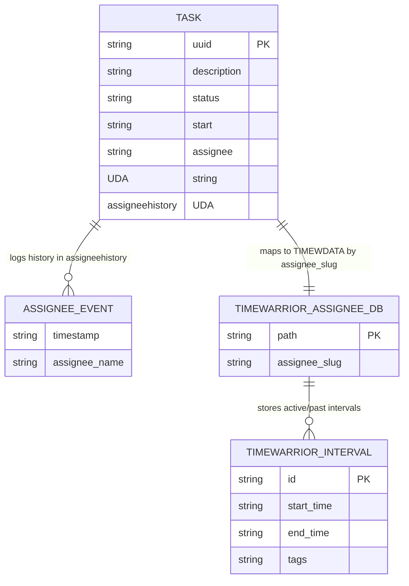

# Data Model: Taskwarrior Parallel Assignees and Timewarrior Integration

## Taskwarrior User Defined Attributes (UDAs)

### 1. Assignee UDA (`assignee`)
- **Key**: `uda.assignee`
- **Type**: `string`
- **Label**: `Assignee`
- **Description**: Stores the currently assigned individual, role, or execution agent for a task.
- **Sync**: Compatible with TaskChampion sync protocol in Taskwarrior 3.x.

### 2. Assignee History UDA (`assigneehistory`)
- **Key**: `uda.assigneehistory`
- **Type**: `string`
- **Label**: `Assignee History`
- **Description**: Append-only audit record of all past and present assignee changes for a task.
- **Format**: Semicolon-delimited list of ISO-8601 UTC timestamped records: `<ISO-8601-UTC-timestamp>: <assignee>`
- **Example Value**: `2026-09-23T10:00:00Z: Alice; 2026-09-23T12:30:00Z: Bob`
- **Sync**: Compatible with TaskChampion sync protocol in Taskwarrior 3.x.

## Timewarrior Assignee Data Directory Model

Each assignee (including unassigned) has an isolated Timewarrior database folder:
```text
~/.timewarrior/assignees/
├── alice/               # TIMEWDATA for Alice
├── bob/                 # TIMEWDATA for Bob
└── unassigned/          # TIMEWDATA for unassigned tasks
```

## Entities & Relationships



## State Transition Rules

### Task Start Transition
- **Trigger**: Task state changes to active (`start` attribute set).
- **Rule**:
  1. Determine `current_assignee = task.assignee || "unassigned"`
  2. Derive `assignee_slug = sanitize(current_assignee)`
  3. Find active tasks (`status == pending` and `start` exists).
  4. Filter active tasks where `other_task.assignee == current_assignee`.
  5. Stop filtered active tasks (`task <uuid> stop`).
  6. If Timewarrior is present:
     - Execute `TIMEWDATA=~/.timewarrior/assignees/<assignee_slug>/ timew start "<task.description>" "<task.uuid>"`

### Assignee Modification Transition
- **Trigger**: Task `assignee` attribute modified or set.
- **Rule**:
  1. Compare `old_task.assignee` vs `new_task.assignee`.
  2. If `new_task.assignee` is present and `new_task.assignee != old_task.assignee`:
     - Format timestamp `TS = UTC_NOW_ISO8601()`
     - Format entry `ENTRY = "TS: new_task.assignee"`
     - Append to `new_task.assigneehistory` with `; ` delimiter.
